## TODO

- [ ] session should be managed automatically

## Table of Contents
- [Task](https://github.com/Ccccraz/mxbi/blob/main/docs/task.md)

## Get Started 🚀

I typically use `uv` to manage a Python project, and I **highly recommend** you use `uv` to start the mxbi code as well.

```shell
cd # Go back to home

cd /path/your_favorite # Choose your favorite directory

git clone https://github.com/Ccccraz/mxbi.git # Clone the mxbi repository

cd mxbi # Enter the mxbi directory

uv sync # Install required dependencies

uv run mxbi # Start mxbi
```

## Current architecture

Currently, the entire code structure is divided into five main parts:


- **User GUI**: used for manually adjusting experiment settings
- **Task scheduler**: used for adjusting task difficulty and switching between tasks
- **Task**: used for executing specific tasks
- **Theater**: serves as the environment for task execution
- **Detector**: Detector, used to detect RFID tags


## Task Scheduler

There were too many different **states** in the original code, which made the code branch paths overly complex. Therefore, I decided to separate the task `scheduler`, ensuring that the tasks themselves are stateless and that their inputs and outputs are deterministic. The task scheduler will ensure that its initial state is correct.

Moreover, the `Protocol` is used to define the interface of Task, which enables the scheduler not only to adjust the difficulty but also to switch between tasks.

## Detector

### Overview

The RFID module should run in an independent thread, performing detection every **100 ms** and triggering corresponding callbacks based on the detection results.

### Detector States

- **NO_ANIMAL**: No animal detected
- **ANIMAL_PRESENT**: One animal detected
- **MORE_THAN_ONE_ANIMAL**: Multiple animals detected (defined as error behavior)

### Data Maintenance

- **current_animal**: Currently detected animal
- **history_animal**: Historical animal record

### State Transition Events

- **NO_ANIMAL → ANIMAL_PRESENT** and current_animal != history_animal: New animal appears
- **NO_ANIMAL → ANIMAL_PRESENT** and current_animal == history_animal: Animal returns
- **ANIMAL_PRESENT → NO_ANIMAL**: Animal leaves
- **ANIMAL_PRESENT → ANIMAL_PRESENT** and current_animal != history_animal: New animal appears
- **ANIMAL_PRESENT → MORE_THAN_ONE_ANIMAL**: Multiple animals detected (error behavior)
- **MORE_THAN_ONE_ANIMAL → ANIMAL_PRESENT**: Recovery
- **MORE_THAN_ONE_ANIMAL → NO_ANIMAL**: Recovery

### Scheduler State Regulation

- **ANIMAL_ENTERED** → Scheduler in SCHEDULE
- **ANIMAL_RETURNED** → Scheduler in SCHEDULE
- **ANIMAL_CHANGED** → Scheduler in SCHEDULE
- **ANIMAL_LEFT** → Scheduler in IDLE
- **ERROR_DETECTED** → Scheduler in ERROR

```mermaid
sequenceDiagram
    participant RFID_Thread
    participant Detector
    participant Scheduler

    loop Every 100 ms
        RFID_Thread->>Detector: Perform detection
        activate Detector

        alt NO_ANIMAL → ANIMAL_PRESENT (current ≠ history)
            Detector->>Detector: State transition
            Detector->>Scheduler: ANIMAL_ENTERED
            Scheduler->>Scheduler: Set to SCHEDULE
        else NO_ANIMAL → ANIMAL_PRESENT (current = history)
            Detector->>Detector: State transition
            Detector->>Scheduler: ANIMAL_RETURNED
            Scheduler->>Scheduler: Set to SCHEDULE
        else ANIMAL_PRESENT → NO_ANIMAL
            Detector->>Detector: State transition
            Detector->>Scheduler: ANIMAL_LEFT
            Scheduler->>Scheduler: Set to IDLE
        else ANIMAL_PRESENT → ANIMAL_PRESENT (current ≠ history)
            Detector->>Detector: State transition
            Detector->>Scheduler: ANIMAL_CHANGED
            Scheduler->>Scheduler: Set to SCHEDULE
        else ANIMAL_PRESENT → MORE_THAN_ONE_ANIMAL
            Detector->>Detector: State transition
            Detector->>Scheduler: ERROR_DETECTED
            Scheduler->>Scheduler: Set to ERROR
        else MORE_THAN_ONE_ANIMAL → ANIMAL_PRESENT
            Detector->>Detector: State transition
            Detector->>Scheduler: Recovery event
            Scheduler->>Scheduler: Set to SCHEDULE
        else MORE_THAN_ONE_ANIMAL → NO_ANIMAL
            Detector->>Detector: State transition
            Detector->>Scheduler: Recovery event
            Scheduler->>Scheduler: Set to IDLE
        end

        deactivate Detector
    end
```



## Extract data model

The states in the original code were scattered across a large number of variables, so I tried to extract all the data models for unified management. You can find most of the data models under `src/mxbi/models`.

## TODO:

- More tasks
- More detailed instruction documents
